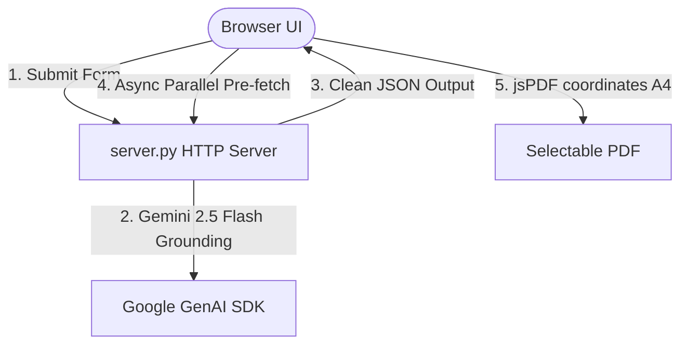

# WanderWing ✈️

WanderWing is a premium, personal AI-powered travel planner that generates hyper-customized, day-by-day travel itineraries. Powered by Google Gemini 2.5 Flash with live Google Search grounding and robust accessibility safeguards, it designs perfect trips tailored to your exact budget, schedule, traveler demographics, and vibes!

---

## ✨ Premium Capabilities & Salient Features

*   **📅 Dynamic Calendar Dates**: Daily timelines calculate sequential calendar dates based on your travel start date (e.g. *Day 1 — Mon, Jun 1, 2026*).
*   **👥 Intelligent Traveler Demographics & Pacing**: Evnforces traveler limits (prevents negative counts) with custom round increment/decrement controls. The planner dynamically tailors itineraries with safety/pacing warnings specifically designed for senior citizens (hydration, heat index, uneven terrain, altitude warnings) and families (kid-friendly scheduling).
*   **💎 Daily Hidden Gems & Secrets**: Highlights niche local facts, interesting legends, viewpoint locations, and secret viewpoints inside every day card.
*   **📸 Authentic Travel Forum & Subreddit Images**: Landmark carousels pull direct real-world imagery grounded in popular travel subreddits (`r/travel`, `r/backpacking`, `r/EarthPorn`) and reputable blogs, wrapping every image in click-through anchors back to the origin thread. Carousels auto-collapse cleanly if images are unavailable or fail to load.
*   **🏨 Grouped Accommodation Sectioning**: 
    *   *Single-Location Stay*: Hotel recommendations are compiled into a dedicated accommodation grid at the end of the timeline, keeping day plans uncluttered.
    *   *Multi-Location Stops*: Stays are rendered underneath each day's dynamic location plan.
*   **🛂 Integrated Concierge Modals**: Asynchronously pre-fetches local phrases, language etiquette, and entry visa requirements in the background while the timeline displays, waking up sleek glassmorphic modals with escape-key and backdrop-click bindings.
*   **📄 Searchable PDF Exports**: Generates selectable standard A4 PDF documents via coordinate-mapped lines, equipped with a custom emoji-sanitizer and clean header/footer layouts.
*   **🌓 curation Dark & Light Themes**: Curated warm earthy visual palettes (terracotta, sage-green, ochre, slate navy) featuring full-screen compass-spinner loaders and a premium organic decay progress bar.

---

## 🏗️ 3-Layer Architecture

WanderWing is built on a robust, separated 3-layer architecture to guarantee system reliability and offline resiliency:



1.  **Directive Layer (SOPs)**: Standard operating procedures written in Markdown (`directives/`) outlining operational goals, edge cases, and architectural specifications.
2.  **Orchestration Layer (Decision-Making)**: Handled by `app.js` and `server.py`, intelligently routing requests, binding user interactions, controlling background fetching loops, and managing persisted state.
3.  **Execution Layer (Deterministic Work)**: Independent backend pathways (`/api/suggest-plan`, `/api/fetch-tips`, `/api/fetch-visa`) executing standard APIs, cleaning models, parsing JSON wrappers, and drawing document coordinates.

---

## 🛠️ Tech Stack

*   **Frontend**: Vanilla HTML5, CSS3 Variables (Warm Earthy theme, full glassmorphic transitions), and Vanilla Javascript (ES6).
*   **Backend**: Light, dependencies-free Python `http.server` running BaseHTTPRequestHandler.
*   **APIs & Libraries**: 
    *   Google GenAI SDK (`google-genai` 2.5 Flash) with live search grounding.
    *   `jsPDF` (Selectable coordinate line-printing export).
    *   OpenStreetMap (Nominatim API autocomplete engine).

---

## 🚀 Quick Start & Development

### 1. Prerequisites
Ensure you have Python 3.10+ installed and a valid Gemini API key.

### 2. Install Dependencies
Install the required Google GenAI SDK:
```bash
pip install google-genai
```

### 3. Set Up Environment Variables
Create a `.env` file in the root directory:
```bash
GEMINI_API_KEY=your_gemini_api_key_here
```

### 4. Run the Web Server
Launch the development server:
```bash
python server.py
```
The server will start instantly on **[http://localhost:8000](http://localhost:8000)**. Enjoy planning your next adventure!
