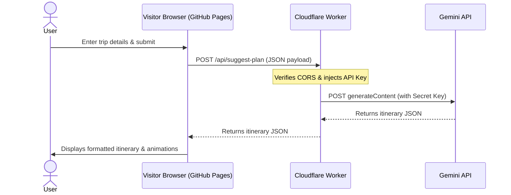

# Implementation Plan: Cloudflare & Eleventy Migration for ItinerAI

This plan outlines how to host the **ItinerAI** frontend within your existing Eleventy-based static website on GitHub Pages, while securely routing Gemini API requests through a free **Cloudflare Worker**.

## User Review Required

> [!IMPORTANT]
> **API Key Security:** The Gemini API key will be stored securely in your Cloudflare dashboard as an encrypted environment variable (Secret). It will never be exposed to the browser or checked into GitHub.

> [!NOTE]
> **CORS Configuration:** The Cloudflare Worker will be configured to allow requests only from your domain (e.g., `ravi-e.github.io` or your custom domain) to prevent other websites from using your backend.

## Proposed Architecture

---

## Proposed Changes

### 1. Frontend Integration (Eleventy)

We will prepare the frontend files to be easily dropped into your Eleventy source directory (typically under `src/` or `projects/` in your `website` repository):

#### [MODIFY] [app.js](file:///f:/AIsandbox/ItinerAI/app.js)
* Update the fetch URLs (currently pointing to relative paths like `/api/suggest-plan`) to point to your new Cloudflare Worker URL (e.g., `https://itinerai-backend.yoursubdomain.workers.dev/api/suggest-plan`).
* Ensure all frontend state management (like loading animations) remains fully intact.

#### [MODIFY] [index.html](file:///f:/AIsandbox/ItinerAI/index.html)
* (Optional) Add front matter if required by Eleventy, or configure Eleventy to pass through these static files directly.

---

### 2. Backend Migration (Cloudflare Worker)

We will create a single-file Cloudflare Worker script that replaces [server.py](file:///f:/AIsandbox/ItinerAI/server.py).

#### [NEW] [worker.js](file:///f:/AIsandbox/ItinerAI/worker.js)
* **API Routes:** Implements routing for `/api/suggest-plan`, `/api/fetch-tips`, and `/api/fetch-visa`.
* **Gemini API Fetch:** Constructs the payload and makes a standard HTTPS `fetch` request to the Gemini API (`https://generativelanguage.googleapis.com/v1beta/models/gemini-2.5-flash:generateContent`).
* **CORS Headers:** Adds `Access-Control-Allow-Origin` headers matching your domain.

---

## Verification Plan

### Automated/Local Testing
* We can test the Cloudflare Worker locally using `wrangler dev` (Cloudflare's local development CLI) before deploying.

### Manual Verification
1. Deploy the Cloudflare Worker to your Cloudflare account.
2. Set the `GEMINI_API_KEY` secret in the Cloudflare dashboard.
3. Test the Worker endpoints using curl or Postman.
4. Open the local Eleventy site, run a test itinerary generation, and verify that the loading animations run and the itinerary displays correctly.
